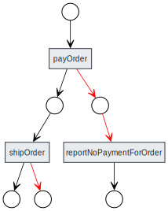

# Doer

Doer is a Java library designed for building fault-tolerant, cluster-ready backend applications using annotations.

It simplifies distributed task execution, automatic retries, and state transitions, ensuring reliable 
processing of complex workflows.

## Features

- Annotation-based API
- Execution in distributed environments
- Automatic retries and failover

## Usage

```xml
<dependency>
    <groupId>com.java-doer</groupId>
    <artifactId>doer</artifactId>
    <version>0.0.15</version>
</dependency>
```
### Since JDK23

Starting from java 23 you need to enable annotation processing explicitly.

Set `-Dmaven.compiler.proc=full` to enable ALL annotation processors.

Or explicitly enable doer annotation processor:

```xml
<build>
    <plugins>
        <plugin>
            <artifactId>maven-compiler-plugin</artifactId>
            <version>3.14.0</version>
            <configuration>
                <annotationProcessorPaths>
                    <path>
                        <groupId>com.java-doer</groupId>
                        <artifactId>doer</artifactId>
                        <version>0.0.15</version>
                    </path>
                </annotationProcessorPaths>
            </configuration>
        </plugin>
    </plugins>
</build>
```

## Example Code

The following code fragment demonstrates how Doer specifies order processing workflow.
This example is part of the **Doer Tutorial** [https://github.com/doer-lib/doertutorial](https://github.com/doer-lib/doertutorial)

```java
@AcceptStatus(GOODS_RESERVED)
@OnException(retry = "every 5s during 10s", setStatus = PAYMENT_FAILED)
public void payOrder(Task task, Order order) {
    Check check = bank.processPayment(order);
    order.setPaymentTransactionId(check.transactionId());
    task.setStatus(ORDER_PAID);
}

@AcceptStatus(PAYMENT_FAILED)
public void reportNoPaymentForOrder(Task task, Order order) {
    order.setRejectReason("Payment not processed.");
    task.setStatus(REJECTED_NO_PAYMENT);
}

@AcceptStatus(ORDER_PAID)
@OnException(retry = "every 5s during 5s", setStatus = ORDER_NOT_SHIPPED)
public void shipOrder(Task task, Order order) {
    TrackId trackId = warehouse.shipTheOrder(order);
    order.setDeliveryTrackingId(trackId.token());
    task.setStatus(ORDER_SHIPPED);
}
```

### Workflow Overview

The following diagram illustrates the state transitions and error-handling mechanisms in this workflow:



---

Contributions and feedback are welcome! Feel free to open an issue or submit a pull request.

